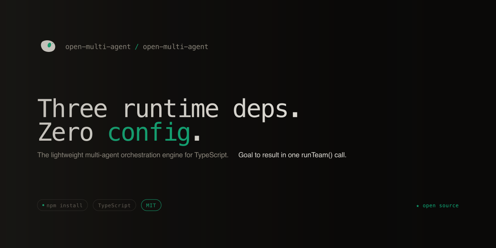

# Open Multi-Agent Website

[English](README.md) | [简体中文](README.zh-CN.md)

The official website, documentation hub, and example browser for [Open Multi-Agent](https://github.com/open-multi-agent/open-multi-agent) — a TypeScript framework that turns a goal into a coordinated task DAG and runs independent work in parallel.

[Live site](https://open-multi-agent.com) · [中文站点](https://open-multi-agent.com/zh/) · [Documentation](https://open-multi-agent.com/getting-started/introduction/) · [Framework repository](https://github.com/open-multi-agent/open-multi-agent) · [npm](https://www.npmjs.com/package/@open-multi-agent/core)



> This repository contains the **website**, not the framework runtime. To install or contribute to Open Multi-Agent itself, visit [`open-multi-agent/open-multi-agent`](https://github.com/open-multi-agent/open-multi-agent).

## What this project is

This site is the public front door for Open Multi-Agent. It helps developers understand the framework, evaluate whether it fits their use case, and move from an idea to working code.

It brings together:

- A product overview built around a captured, real `runTeam()` task DAG
- Getting-started guides and the complete framework reference
- Runnable examples with browsable TypeScript source
- Architecture, solutions, integrations, and framework comparisons
- Community projects, production use cases, and technical articles
- Full English and Simplified Chinese experiences

The result is one statically generated site for discovery, learning, and technical evaluation — rather than a marketing page separated from its docs and examples.

## Built with

- [Astro](https://astro.build) for the site and static generation
- [Starlight](https://starlight.astro.build) for documentation
- TypeScript for components, content tooling, and locale parity checks
- Markdown content collections for documentation and the blog
- GitHub Actions for validation and upstream data synchronization

## Local development

Prerequisites: **Node.js 22** and **pnpm 10**.

```bash
pnpm install
pnpm dev
```

The development server runs at [http://localhost:4321](http://localhost:4321).

Before opening a pull request, run the same core checks used by CI:

```bash
pnpm check
pnpm build
```

To preview the production build locally:

```bash
pnpm preview
```

No GitHub token is required to build the site. Repository statistics and the example inventory are read from committed snapshots, keeping local and production builds deterministic.

## Project structure

```text
src/
├── components/        Shared navigation, footer, CTAs, and design-system primitives
├── content/
│   ├── docs/          Starlight documentation in English and Chinese
│   └── blog/          English posts and Chinese translations
├── data/              Captured runs and synchronized GitHub data snapshots
├── i18n/              Typed UI dictionaries and locale helpers
├── layouts/           Shared page shells and metadata
├── lib/               Examples, integrations, solutions, comparisons, and site data
├── pages/             Localized landing, docs-adjacent, example, and blog routes
└── styles/            Design tokens and page-level themes
scripts/               Content sync, snapshot refresh, translation, and asset tooling
public/                Logos, social cards, diagrams, media, robots.txt, and llms.txt
```

## Content and data model

The site intentionally separates content maintained here from content owned by the framework repository:

- **Getting Started and Guides** are authored in this repository.
- **Reference docs** are synchronized from the framework repository so API documentation stays aligned with the published package.
- **Examples and repository statistics** come from committed snapshots refreshed by automation. Builds never depend on a live GitHub API response.
- **The landing-page DAG** comes from a captured Open Multi-Agent run, not a hand-drawn mock.
- **English is the source locale.** Chinese UI dictionaries are checked against it key for key, while translated content mirrors the English content tree.

For translation conventions and workflow, see [TRANSLATING.md](TRANSLATING.md).

## Contributing

Contributions that improve clarity, correctness, accessibility, performance, or the learning path are welcome.

When changing the site:

1. Keep English and Chinese UI dictionaries in sync.
2. Run `pnpm check` and `pnpm build`.
3. Submit changes through a pull request; do not push directly to `main`.

If a Reference page is incorrect, fix it in the [framework repository](https://github.com/open-multi-agent/open-multi-agent) first, then synchronize it here. This prevents the website and the package documentation from drifting apart.

## Related projects

- [`open-multi-agent/open-multi-agent`](https://github.com/open-multi-agent/open-multi-agent) — the TypeScript framework and canonical API source
- [`@open-multi-agent/core`](https://www.npmjs.com/package/@open-multi-agent/core) — the published npm package
- [`open-multi-agent/oma-forge`](https://github.com/open-multi-agent/oma-forge) — the Open Multi-Agent ecosystem forge
